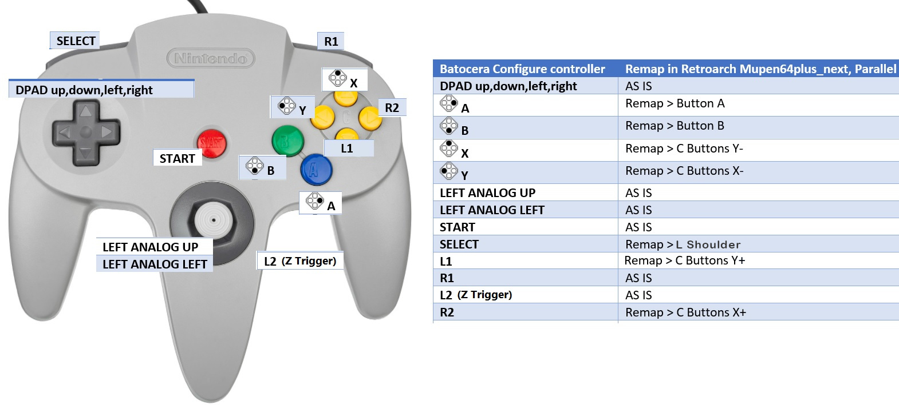

# 4dapter - HID Firmware for MiSTer / PC / Batocera

This single sketch replaces what used to be four separate, nearly-identical firmware
folders. Which variant you get is chosen at **build time** via the `HID_LAYOUT` flag
at the top of [4dapter_FW-HID.ino](4dapter_FW-HID.ino):

| Layout | Gamepads reported | Use case |
|---|---|---|
| `HID_LAYOUT_TRIPLE` (default) | 3: NES+SNES combined, Genesis, N64 | MiSTer, PC, Raspberry Pi, RetroArch — multiplayer from a single unit |
| `HID_LAYOUT_TRIPLE_ALT` | 3: NES, SNES, Genesis+N64 combined | Same as above, but with NES and SNES on separate gamepads instead |
| `HID_LAYOUT_SINGLE` | 1: all four controllers combined | Batocera (or anything that only binds one device) |
| `HID_LAYOUT_QUAD` | 4: NES, SNES, Genesis, N64 each separate | MiSTer — needs `CDC_DISABLED`, see below |

If you just want a working `.hex` file, the easiest path is the **web flasher** (see the
root [README](../README.md)) — it flashes a pre-built binary for whichever layout you
want with no Arduino IDE required. The rest of this document is for building from
source.

## Building from source

### Option A — Arduino IDE

1. Install **Arduino AVR Boards → Arduino Leonardo** from the Boards Manager.
2. Make the shared library available to the IDE (one-time step):
   ```
   ln -s "$(pwd)/../lib/4dapterCore" ~/Documents/Arduino/libraries/4dapterCore
   ln -s "$(pwd)/../lib/4dapterHID"  ~/Documents/Arduino/libraries/4dapterHID
   ```
3. Open `4dapter_FW-HID.ino` and edit the `#define HID_LAYOUT` line near the top to pick
   your layout (default is `HID_LAYOUT_TRIPLE`).
4. For `HID_LAYOUT_QUAD` only: see [Getting all 4 endpoints](#getting-all-4-endpoints-hid_layout_quad) below — you need an extra step to free a USB endpoint.
5. Upload as usual.

### Option B — arduino-cli / CI

See [`ci/build-all.sh`](../ci/build-all.sh) in the repo root — it builds all 6 firmware
variants (including all 4 layouts of this sketch) in one pass and is what the GitHub
Actions workflow runs to publish release binaries. For one layout by hand:

```bash
arduino-cli compile --fqbn arduino:avr:leonardo \
  --library ./lib/4dapterCore --library ./lib/4dapterHID \
  --build-property "build.extra_flags=-DHID_LAYOUT=HID_LAYOUT_SINGLE" \
  4dapter_FW-HID
```

## Getting all 4 endpoints (HID_LAYOUT_QUAD)

The ATmega32U4 has limited USB endpoints. With serial (CDC) enabled, only three HID
gamepads are available and the N64 port will not appear. To get all four gamepads you
must build with `CDC_DISABLED`.

**Building with arduino-cli** (recommended — no changes to your Arduino install):
```bash
arduino-cli compile --fqbn arduino:avr:leonardo \
  --library ./lib/4dapterCore --library ./lib/4dapterHID \
  --build-property "build.extra_flags=-DHID_LAYOUT=HID_LAYOUT_QUAD" \
  --build-property "compiler.c.extra_flags=-DCDC_DISABLED" \
  --build-property "compiler.cpp.extra_flags=-DCDC_DISABLED" \
  4dapter_FW-HID
```

**Building with the Arduino IDE** (needs a one-time core patch): copy this folder's
[`platform.local.txt`](platform.local.txt) into the same folder as the AVR platform your
Arduino IDE uses, then clear the IDE's build cache and recompile.

1. Enable **File → Preferences → Show verbose output during compilation**, then compile
   once and look for a line like "Using core ... from platform in folder: ...". That's
   the folder that should contain `platform.local.txt`.
   - **macOS:** `~/Library/Arduino15/packages/arduino/hardware/avr/1.8.7/`
   - **Windows:** `%LOCALAPPDATA%\Arduino15\packages\arduino\hardware\avr\1.8.7\`
   - **Linux:** `~/.arduino15/packages/arduino/hardware/avr/1.8.7/`
2. Quit the IDE, delete the build cache folder (path shown in the verbose compile
   output as "-build-cache ..."), reopen, and compile again. You should see
   `-DCDC_DISABLED` in the verbose log when the core compiles.
3. **Uploading:** with CDC disabled, the board no longer appears as a serial port. Start
   the upload from the IDE, and when it says "Uploading…", press the reset button on the
   4dapter PCB — the board enters the bootloader and the upload completes.

**Windows:** even with `CDC_DISABLED` correctly applied, Windows may only show 3 of the
4 controller endpoints. The device itself correctly reports 4 HID interfaces (verified
with USBView: `bNumInterfaces = 4`, all descriptors valid) — this is a limitation of
Windows' USB composite driver (`Usbccgp.sys`) enumerating composite HID devices, not a
firmware bug, and isn't something firmware alone can fix. Try a direct motherboard USB
port (not a hub); if an interface shows under **Other devices** with a warning in Device
Manager, try **Update driver → Let me pick → HID-compliant game controller**.

## MiSTer - Define Joystick Buttons (Mapping)

### Via .map File
For maximum compatibility, install the MiSTer controller Map file found in the
[MiSTer Maps Folder](https://github.com/timville85/4dapter/tree/main/MiSTer%20Maps) to
your `/media/fat/config/inputs` directory on your MiSTer SD card and reboot your
MiSTer. After doing this, you'll need to map the N64 controller in the N64 core for all
buttons to work. The SNES / Genesis / NES cores will already be properly configured via
the Map file, so do not map the individual cores or else conflicts may occur.

### Manual Mapping
If manually mapping in the MiSTer main menu, use the N64 controller using the following
steps and NES / SNES / Genesis will be appropriately mapped for their cores:
```
DPAD Test: Press RIGHT     ---  D-Right
Stick 1 Test: Tilt RIGHT   ---  Analog Stick Right
Stick 1 Test: Tilt DOWN    ---  Analog Stick Down
Stick 2 Test: Tilt RIGHT   ---  Undefine (User / Space to Skip)
Press: RIGHT               ---  Analog Stick Right
Press: LEFT                ---  Analog Stick Left
Press: DOWN                ---  Analog Stick Down
Press: UP                  ---  Analog Stick Up
Press: A                   ---  A Button
Press: B                   ---  B Button
Press: X                   ---  C-Down Button
Press: Y                   ---  C-Left Button
Press: L                   ---  Left Bumper Button
Press: R                   ---  Right Bumper Button
Press: Select              ---  C-Right Button
Press: Start               ---  Start Button
Press: Mouse Move RIGHT    ---  Undefine (User / Space to Skip)
Press: Mouse Move LEFT     ---  Undefine (User / Space to Skip)
Press: Mouse Move DOWN     ---  Undefine (User / Space to Skip)
Press: Mouse Move UP       ---  Undefine (User / Space to Skip)
Press: Mouse Btn Left      ---  Undefine (User / Space to Skip)
Press: Mouse Btn Right     ---  Undefine (User / Space to Skip)
Press: Mouse Btn Middle    ---  Undefine (User / Space to Skip)
Press: Mouse Emu/Sniper    ---  Undefine (User / Space to Skip)
Press: Menu                ---  C-Right Button + Analog Stick Down
Note: C-Right Button + Analog Stick Down makes Select/Mode + Down work for NES/SNES/GEN
      This may cause menu to appear in some gameplay, so adapt as needed.
Press: Menu: OK            ---  A Button
Press: Menu: Back          ---  B Button
Stick 1: Tilt RIGHT        ---  Analog Stick Right
Stick 1: Tilt DOWN         ---  Analog Stick Down
```

## Controller Button Mapping

To maintain proper button mapping on MiSTer, it's recommended to map the SNES
controller on the MiSTer Main menu and the NES / Genesis controllers will align to
their core defaults properly.

```
     NES    PowerPad  SNES     GEN(normal)  GEN(MiSTer)  N64
-------------------------------------------------------------------
X    U/D    N/A       U/D      U/D          U/D          Stick U/D
Y    L/R    N/A       L/R      L/R          L/R          Stick L/R
01   B      Pad 01    B        B            A            B
02   A      Pad 02    A        A            B            A
03   N/A    Pad 03    Y        Y            X            C-Left
04   N/A    Pad 04    X        X            Y            C-Down
05   N/A    Pad 05    L        Z            Z            L
06   N/A    Pad 06    R        C            C            R
07   SELECT Pad 07    SELECT   MODE         MODE         C-Right
08   START  Pad 08    START    START        START        START
09   N/A    Pad 09    NTT 0    HOME(8BitDo) [SPECIAL]    Z
10   N/A    Pad 10    NTT 1    N/A          N/A          D-Up
11   N/A    Pad 11    NTT 2    N/A          N/A          D-Down
12   N/A    Pad 12    NTT 3    N/A          N/A          D-Left
13   N/A    N/A       NTT 4    N/A          N/A          D-Right
14   N/A    N/A       NTT 5    N/A          N/A          C-Up
15   N/A    N/A       NTT 6    N/A          N/A          N/A
16   N/A    N/A       NTT 7    N/A          N/A          N/A
17   N/A    N/A       NTT 8    N/A          N/A          N/A
18   N/A    N/A       NTT 9    N/A          N/A          N/A
19   N/A    N/A       NTT *    N/A          N/A          N/A
20   N/A    N/A       NTT #    N/A          N/A          N/A
21   N/A    N/A       NTT .    N/A          N/A          N/A
22   N/A    N/A       NTT C    N/A          N/A          N/A
23   N/A    N/A       N/A      N/A          N/A          N/A
24   N/A    N/A       NTT End  N/A          N/A          N/A

* GENESIS(MiSTer): Mode will send Select + Down
* HID_LAYOUT_QUAD has no GEN(MiSTer) mode — Genesis HOME is always a raw button, never remapped.
```

## MiSTer Home Menu Suggestion
* **NES:** SELECT + DOWN
* **SNES:** SELECT + DOWN
* **GENESIS:** MODE + DOWN

*Note: SELECT + DOWN = HOME on 8BitDo N30*

## MiSTer mode on 8bitdo M30 controller

`HID_LAYOUT_TRIPLE`, `HID_LAYOUT_TRIPLE_ALT`, and `HID_LAYOUT_SINGLE` expose three (or
four) "players" on one USB device. Unfortunately MiSTer does not support setting
keymaps per "player"; MiSTer mode works around this by making sure the positional
mapping is the same between all controllers.

MiSTer mode can be toggled on and off with "HOME + Z" (you have to press HOME first, Z
second). This setting is saved to EEPROM and preserved across power cycles. The default
is "normal mode". (`HID_LAYOUT_QUAD` does not have this mode — see the table note above.)

When the Genesis controller is in MiSTer mode:
- The HOME button sends "DOWN + MODE" (no equivalent of the HOME button exists on the
  other controller ports)
- Buttons are swapped: A with B and X with Y, so the position of the buttons is
  consistent between SNES and Genesis.

## Batocera (HID_LAYOUT_SINGLE)

Build with `HID_LAYOUT_SINGLE` to use the 4dapter in Batocera — no further code changes
are required. NES, SNES, and Genesis controllers will be mapped automatically for
immediate use. N64 controllers will need to be re-mapped in RetroArch
(Mupen64Plus-Next) according to the diagram below:



An example re-map for player 1 is in [Mupen64Plus-Next.rmp](Mupen64Plus-Next.rmp), which
can be manually copied to
`/userdata/system/.config/retroarch/config/remaps/Mupen64Plus-Next`.

### Older versions of Batocera
This mapping is included in Batocera 42+, but can be manually added to your
`/userdata/system/configs/emulationstation/es_input.cfg` on older versions with the
content in [es_last_input.cfg](es_last_input.cfg).

## RetroArch Port Binding

Some RetroArch users have reported issues regarding setting the correct "Device Index"
setting, since a multi-gamepad layout (`TRIPLE`/`TRIPLE_ALT`/`QUAD`) reports a single
"device" to RetroArch with each controller as its own "index".

In RetroArch, go to Settings → Input → Port 1 Binds → Device Index and choose the
index for the port you want. Save and it sticks for that game, core, or content
directory.

- https://retropie.org.uk/forum/topic/26681/port-binds/
- https://retropie.org.uk/docs/RetroArch-Configuration/#core-input-remapping

## Restoring Firmware After Alternative Firmware Downloads

If you previously flashed the Switch or XInput firmware, your Arduino Pro Micro will no
longer report as a Serial device and will not appear in the "Port" list in the Arduino
software. This HID firmware (with CDC enabled, i.e. any layout except `HID_LAYOUT_QUAD`
with `CDC_DISABLED`) does not suffer from this issue once it's flashed, but to get back
to it you may need to:

1. Open this sketch in the Arduino IDE (or use the web flasher).
2. Connect your 4dapter via USB.
3. Trigger the upload/download. If using the Arduino IDE, it will compile first.
4. Once compiling finishes, trigger a reset on the Arduino Pro Micro by briefly
   touching the Reset (RST) and Ground (GND) pins together (or pressing the reset
   button on the 4dapter PCB), forcing it into bootloader mode so the upload can
   complete. If the first attempt fails to find the port, repeat — it usually works on
   the second try.
